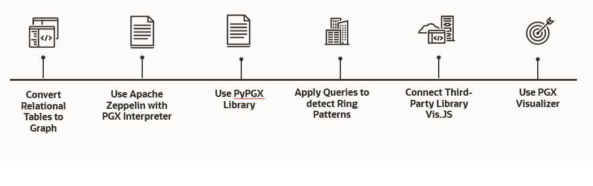

# 

Machine Learning Workshop with Oracle Graph

## Introduction
Explore how to build a Bank Fraud Detection engine using Oracle Graph on a real-world dataset residing in Oracle Autonomous Database.

## About this workshop 

This workshop walks you through the steps to build a Bank Fraud Detection engine using Oracle Graph on a real-world dataset residing in Oracle Autonomous Database. You will access to a bank dataset, use Graph Server, create a Property Graph data model, perform graph visualization and graph analysis.

## Workshop Details

To demonstrate the Oracle Graph functionalities, the workshop has been divided in different steps.

The manual to execute the workshop step by step is available
<a href="https://github.com/operard/mlgraph/blob/main/doc/WORKSHOP_MLGraph.pdf">here</a>

### Step 1: Convert from Relational Data Model to Property Graph Data Model.

### Step 2: Use Open Source Apache Zeppelin with PGX Interpreter and Groovy.

### Step 3: Use Python to access to Oracle Graph “PyPGX”.

### Step 4: Apply Queries to detect Ring Patterns in the Graph Data Model

### Step 5: Connect Third-Party Library Vis.JS from Python.

### Step 6: Use PGX Visualizer.

## Conclusions

In this workshop, we have seen how you can reuse and convert a 3FN relational data model in order to apply Queries and Machine Learning algorithms using the same Oracle Database.

This functionality is available in order to apply fast use cases on the relationships between entities.

You can continue to implement Oracle Graph use cases using the free labs available in the next URLs:

<ul>
<li>
Oracle Property Graph for Real-Time Recommendations Workshop
</li>
</ul>

<a href="https://apexapps.oracle.com/pls/apex/dbpm/r/livelabs/view-workshop?wid=754">https://apexapps.oracle.com/pls/apex/dbpm/r/livelabs/view-workshop?wid=754</a>

<ul>
<li>
Analyze and Visualize Property Graphs with Oracle Database Workshop
</li>
</ul>

<a href="https://apexapps.oracle.com/pls/apex/dbpm/r/livelabs/view-workshop?wid=687">https://apexapps.oracle.com/pls/apex/dbpm/r/livelabs/view-workshop?wid=687</a>

<ul>
<li>
Getting started with Oracle Property Graph on Docker Workshop
</li>
</ul>

<a href="https://apexapps.oracle.com/pls/apex/dbpm/r/livelabs/view-workshop?wid=712">https://apexapps.oracle.com/pls/apex/dbpm/r/livelabs/view-workshop?wid=712</a>

Other Labs in Machine Learning, AI, Data Management, …etc… are available in the next URL:

<a href="https://apexapps.oracle.com/pls/apex/dbpm/r/livelabs/livelabs-workshop-cards?clear=100&amp;session=101956397438991">https://apexapps.oracle.com/pls/apex/dbpm/r/livelabs/livelabs-workshop-cards?clear=100&amp;session=101956397438991</a>

## More Examples

<a href="https://github.com/oracle/pgx-samples/blob/master/README.md">Oracle Property Graph Examples</a>

